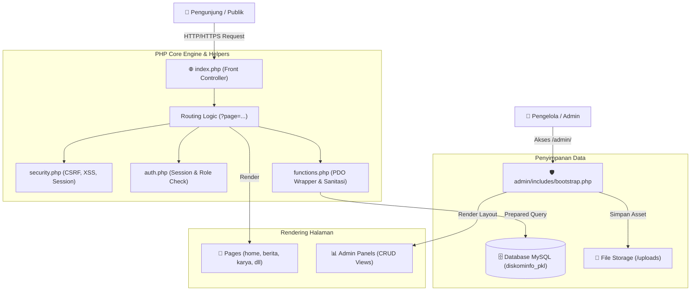
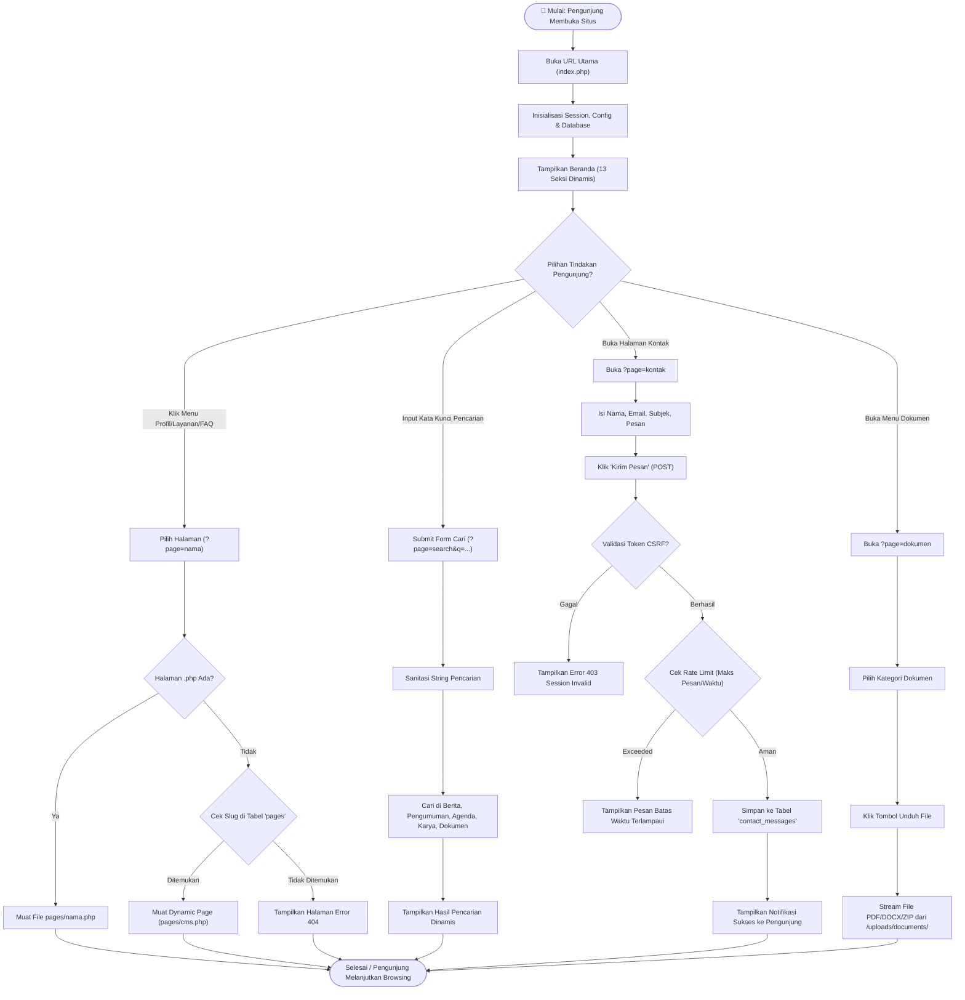
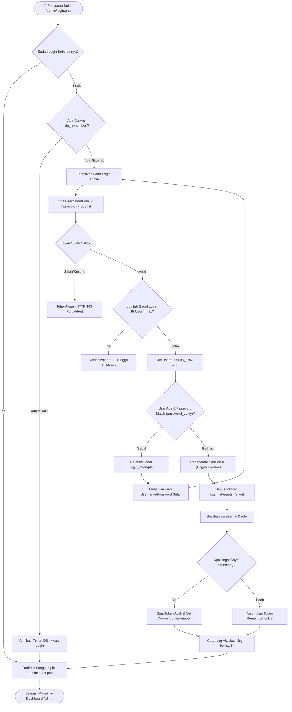
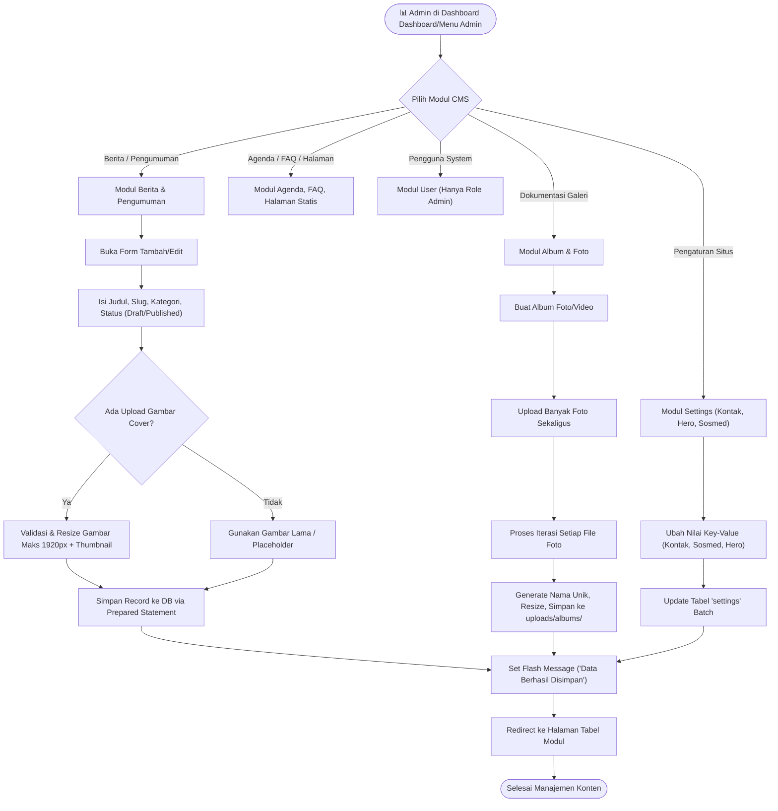
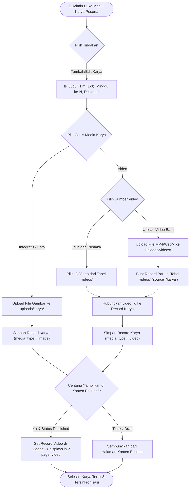

# Spesifikasi Alur Kerja & Diagram Flowchart Portal PKL & Magang Diskominfo Banten

Dokumen ini berisi spesifikasi sistem, logika bisnis, dan diagram flowchart lengkap (berbasis Mermaid) untuk **Portal PKL & Magang Diskominfo Provinsi Banten**. Dokumen ini dirancang khusus agar mudah dipahami oleh pengembang maupun dapat diolah kembali oleh AI lain (seperti Napkin AI, ChatGPT, Claude, Draw.io, atau Mermaid Editor) untuk menghasilkan visualisasi yang lebih artistik.

---

## 📌 Daftar Isi Flowchart
1. [Arsitektur Umum Sistem (System Architecture Overview)](#1-arsitektur-umum-sistem)
2. [Flowchart 1: Alur Navigasi & Interaksi Pengunjung Publik (Public Flow)](#2-flowchart-1-alur-navigasi--interaksi-pengunjung-publik)
3. [Flowchart 2: Alur Autentikasi & Keamanan Login Admin (Auth & Security Flow)](#3-flowchart-2-alur-autentikasi--keamanan-login-admin)
4. [Flowchart 3: Alur Pengelolaan Konten & CMS Admin (CRUD Management Flow)](#4-flowchart-3-alur-pengelolaan-konten--cms-admin)
5. [Flowchart 4: Logika Khusus Modul Karya Peserta & Integrasi Pustaka Video](#5-flowchart-4-logika-khusus-modul-karya-peserta--integrasi-pustaka-video)
6. [Flowchart 5: Alur Validasi & Upload File Media (Upload Security Flow)](#6-flowchart-5-alur-validasi--upload-file-media)

---

## 1. Arsitektur Umum Sistem

Sistem berbasis **PHP 8 Native (Tanpa Framework)** dengan arsitektur **Front Controller** (`index.php`) dan **Database MySQL/MariaDB**.



---

## 2. Flowchart 1: Alur Navigasi & Interaksi Pengunjung Publik

Alur perjalanan pengguna umum saat mengakses portal publik dari beranda hingga pengiriman pesan kontak atau pencarian informasi.



---

## 3. Flowchart 2: Alur Autentikasi & Keamanan Login Admin

Alur autentikasi berlapis untuk pengelola/admin mencakup proteksi CSRF, pencatatan batas percobaan login (Rate Limiting), verifikasi hash BCRYPT, sesi aman, serta fungsi *Remember Me*.



---

## 4. Flowchart 3: Alur Pengelolaan Konten & CMS Admin

Alur umum manajemen konten (Create, Read, Update, Delete) oleh Admin/Editor di dalam panel kontrol.



---

## 5. Flowchart 4: Logika Khusus Modul Karya Peserta & Integrasi Pustaka Video

Modul Karya Peserta memiliki bisnis logika unik: menyatukan media Infografis/Foto/Video, mengintegrasikan Pustaka Video tunggal tanpa duplikasi file, serta fitur sinkronisasi **Konten Edukasi** ke halaman publik.



---

## 6. Flowchart 5: Alur Validasi & Upload File Media

Logika keamanan komprehensif untuk menangani file upload guna mencegah peretasan (seperti upload script RCE/PHP).

```mermaid
flowchart TD
    UploadStart(["📁 Proses Upload File Diinisialisasi"]) --> CheckFileSelected{"File Dipilih & Tidak Error Code?"}
    
    CheckFileSelected -->|Kosong / Error| ReturnErrNoFile["Return Error: File Tidak Valid"]
    CheckFileSelected -->|Ada File| CheckSize{"Cek Ukuran File vs Limit (5MB Image / 100MB Video)"}
    
    CheckSize -->|Melebihi Limit| ReturnErrSize["Return Error: Ukuran File Terlalu Besar"]
    CheckSize -->|Aman| DetectMIME["Deteksi MIME Real via finfo_file() (Bukan Ekstensi)"]
    
    DetectMIME --> CheckMIMEAllowed{"MIME Type Diizinkan? (image/jpeg, video/mp4, pdf, dll)"}
    
    CheckMIMEAllowed -->|Ditolak/Script| ReturnErrType["Return Error: Format File Dilarang!"]
    CheckMIMEAllowed -->|Diterima| CheckExt{"Double Check Ekstensi File blacklist (.php, .exe, dll)"}
    
    CheckExt -->|Berbahaya| ReturnErrType
    CheckExt -->|Aman| GenerateUniqueName["Generate Nama File Unik (hash random string)"]
    
    GenerateUniqueName --> CheckIsImage{"Apakah Berkas Bertipe Gambar?"}
    
    CheckIsImage -->|Ya| AutoResize["Resize Gambar Maksimum 1920px & Buat Crop Thumbnail"]
    CheckIsImage -->|Tidak (Video/Doc)| SkipResize["Gunakan File Asli"]
    
    AutoResize --> MoveToFolder["Pindahkan File ke Target Folder (/uploads/...)"]
    SkipResize --> MoveToFolder
    
    MoveToFolder --> VerifyHtaccess["Proteksi Direktori Upload via .htaccess (Disable Script Execution)"]
    VerifyHtaccess --> ReturnSuccess["Return Path File Berhasil Disimpan"]
    
    ReturnErrNoFile --> EndUpload(["Proses Selesai (Gagal/Ganti Input)"])
    ReturnErrSize --> EndUpload
    ReturnErrType --> EndUpload
    ReturnSuccess --> EndUpload(["Proses Selesai (File Siap Digunakan)"])
```

---

## 📝 Ringkasan Ketentuan Logika Sistem

1. **Routing & URL Structure**:
   - Front-end Publik menggunakan `index.php?page={slug}`.
   - Admin Panel menggunakan berkas eksplisit seperti `/admin/{modul}.php` (misal `/admin/index.php` untuk Dashboard, `/admin/news.php` untuk Berita).

2. **Keamanan (Security Matrix)**:
   - **XSS & Injection**: Menggunakan PDO Prepared Statement untuk seluruh query database + fungsi sanitasi XSS `e()` saat render HTML.
   - **CSRF Protection**: Setiap form mutlak dilengkapi token hidden CSRF yang diverifikasi oleh `require_csrf()`.
   - **File Upload Security**: Pembatasan ekstensi, pemeriksaan MIME asli melalui `finfo_file()`, perusakan eksekusi skrip PHP di folder `/uploads/` menggunakan `.htaccess` (`SetHandler none`).
   - **Rate Limiting**: Pembatasan percobaan login (maksimal 5 kali gagal per 15 menit) dan pengiriman pesan kontak.

---
*Dokumen ini dibuat otomatis sebagai acuan teknis dan alur diagram untuk Portal PKL & Magang Diskominfo Banten.*
